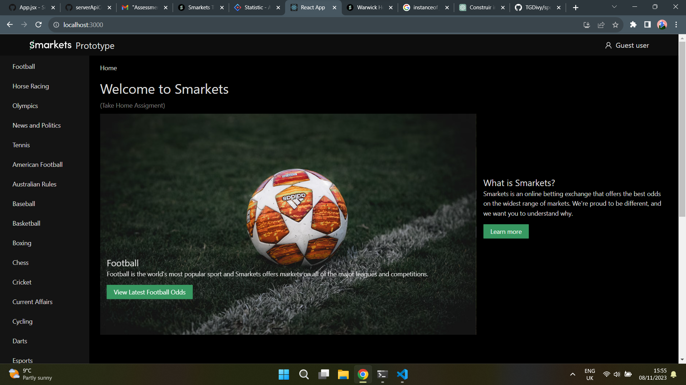
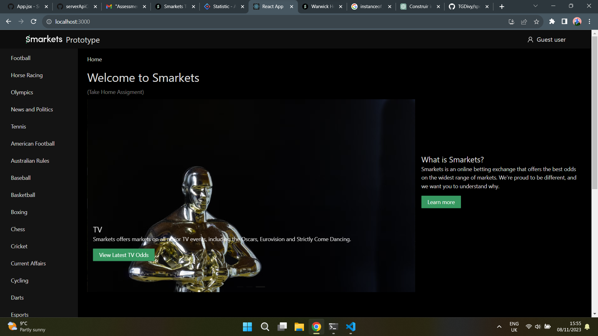
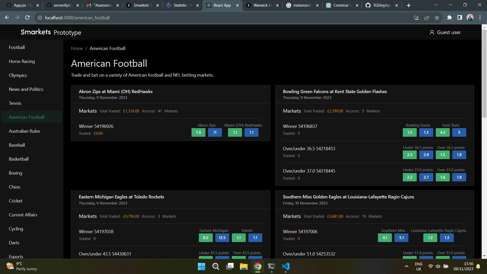
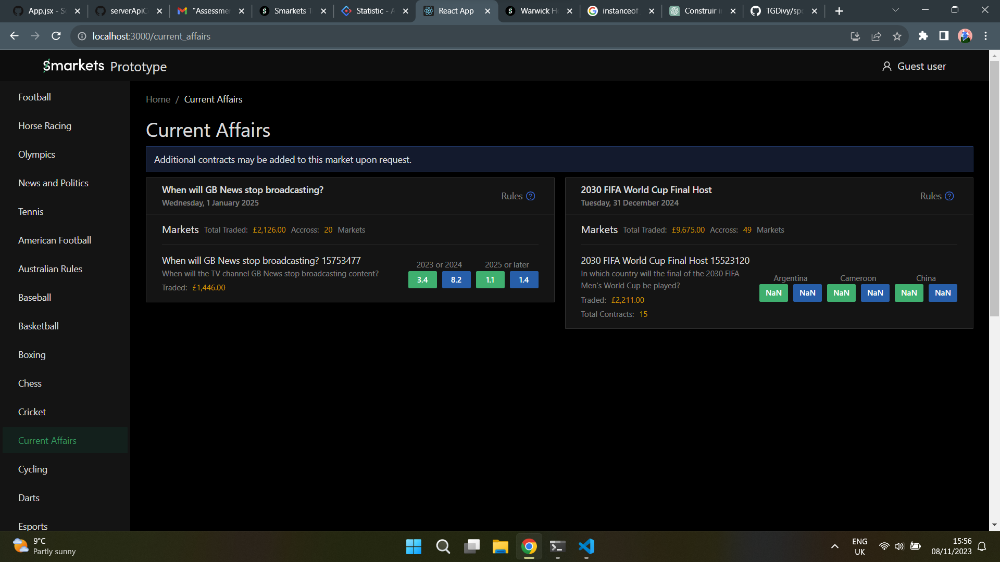

# Smarkets Frontend Challenge

## Getting Started

This project uses Docker Compose to run a React app and a CORS bypasser. Follow these simple steps to get the project up and running locally.

### Prerequisites

Docker installed on your machine.

### Step 1: Clone the Repository

Clone this repository to your local machine.

```bash
git clone https://github.com/TGDivy/sports-betting-markets
```

### Step 2: Build and Run with Docker Compose

In the project root directory, use Docker Compose to build and run the services:

```bash
docker-compose build
docker-compose up
```

### Step 3: Access the Application

Once the Docker containers are up and running, you can access the application in your web browser at http://localhost.

## Notes

The Docker Compose setup includes a React app and a CORS bypasser to handle CORS issues for API requests.

The project replicates the Smarkets brand feel and colors.

If you encounter any issues or have questions, feel free to reach out for assistance.

Enjoy using the application!

This README provides a simple and concise guide to get your project running using Docker Compose, and it includes important information for users to understand how to access and use the application.

## If I Had More Time...

If I had more time, I would have implemented the following features:

- Code splitting and lazy loading for the React app.
- Imrpoved and Specifc Error handling for differnt api calls.
- Authentication, and route guarding.
- Unit tests for the React app.
- More detailed documentation for the project.

## Screenshots




